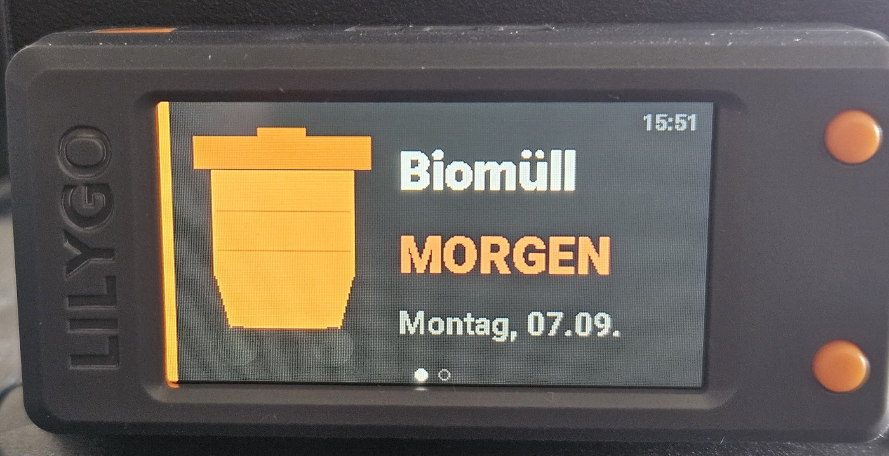
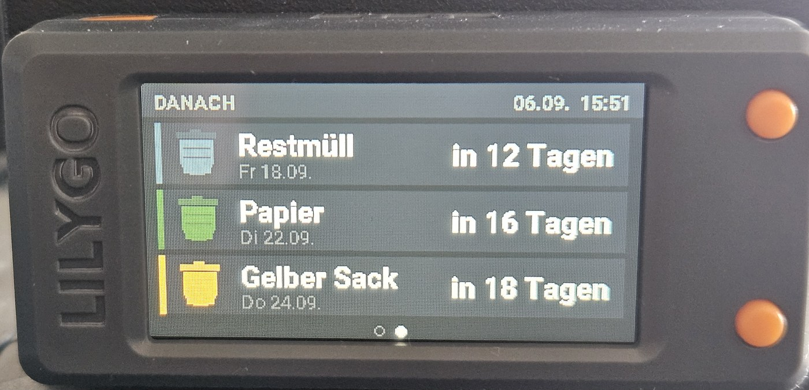

# Müllabfuhr-Anzeige für LilyGo T-Display-S3

Eine ESPHome-Konfiguration, die die nächsten Abholtermine aus Home Assistant im
Querformat anzeigt. Die Termine liefert die Integration
[Waste Collection Schedule](https://github.com/mampfes/hacs_waste_collection_schedule),
die über HACS installiert wird und weit über hundert Entsorger in Europa
abdeckt.

Zwei Seiten, die alle 5 Sekunden von allein wechseln:

**Seite 1** zeigt formatfüllend nur den nächsten Termin: eine große gezeichnete
Tonne in der Farbe der Müllart, daneben die Müllart, die Restzeit und das
ausgeschriebene Datum. Steht die Abholung heute oder morgen an, steht dort
statt einer Zahl `HEUTE` bzw. `MORGEN` in Rot.



**Seite 2** listet die drei danach fälligen Müllarten mit Mini-Tonne, Datum und
Restzeit.



Die Reihenfolge ergibt sich immer aus den Daten, es gibt keine feste Zuordnung
von Müllart zu Position. Fehlt ein Sensor oder ist er noch ohne Wert, rutscht
die Tonne ans Ende und zeigt `--`.

Die Gehäusetaste KEY schaltet zusätzlich von Hand weiter, BOOT schaltet die
Hintergrundbeleuchtung.

## Hardware

LilyGo T-Display-S3, ESP32-S3 mit 1,9-Zoll-Display, 170 × 320 Pixel,
Octal-PSRAM. Die Konfiguration nutzt `mipi_spi` mit `model: t-display-s3` und
`rotation: 90` für das Querformat. Steht das Bild auf dem Kopf, `rotation: 270`
setzen.

Andere Displays lassen sich verwenden, wenn die Koordinaten in der Lambda
angepasst werden, siehe [Layout anpassen](#layout-anpassen).

Gebaut und auf dem Gerät getestet mit ESPHome 2026.8.2.

## Einrichtung

### 1. Waste Collection Schedule in Home Assistant

Die Integration über HACS installieren und in der `configuration.yaml` den
eigenen Entsorger eintragen. Welcher Anbieter zuständig ist und welche
Parameter er braucht, steht in der
[Liste der unterstützten Dienste](https://github.com/mampfes/hacs_waste_collection_schedule/blob/master/doc/source/).

Anschließend je Müllart einen Sensor anlegen. Wichtig ist `count: 1`, damit
jeder Sensor nur den nächsten Termin seiner Art liefert:

```yaml
waste_collection_schedule:
  - name: biotonne
    types:
      - Biotonne
    count: 1
```

### 2. Entity-IDs heraussuchen

Unter Einstellungen → Geräte & Dienste → Entitäten nach `waste_collection`
filtern. Die IDs folgen dem Muster
`sensor.waste_collection_schedule_<name>`.

Wie die Müllarten heißen, legt der örtliche Entsorger fest — mal `Biotonne`,
mal `Bioabfallbehälter`, mal `Bioabfall`. Die Namen aus der eigenen Anlage in
die `substitutions` eintragen, nicht die aus diesem Beispiel übernehmen.

### 3. Zustandsformat prüfen

Die Anzeige liest den Zustandstext der Sensoren und zieht die Tageszahl heraus.
Erwartet wird die Voreinstellung der Integration, also etwa:

```
Biotonne in 12 days
```

Erkannt werden außerdem `Today`, `Tomorrow`, `heute` und `morgen`. Wer das
`value_template` so umgestellt hat, dass gar keine Zahl mehr im Text steht,
muss entweder das Template zurücknehmen oder `days_of()` in der Lambda
anpassen.

Ein eigenes Datum berechnet das Gerät selbst aus der Home-Assistant-Zeit plus
Tagesabstand. Zusätzliche Template-Sensoren braucht es nicht.

### 4. secrets.yaml

`secrets.yaml.example` nach `secrets.yaml` kopieren und ausfüllen:

```yaml
wifi_ssid: "MeinWLAN"
wifi_password: "geheim"
api_key: "<32 Byte Base64, von ESPHome erzeugt>"
ap_password: "<Passwort des Fallback-Hotspots>"
```

Den API-Verschlüsselungsschlüssel erzeugt ESPHome beim Anlegen eines neuen
Geräts. `secrets.yaml` steht in der `.gitignore` und gehört nicht ins
Repository.

### 5. Flashen

`muelltonnen-display.yaml` und `secrets.yaml` ins ESPHome-Verzeichnis legen und
das Gerät einmal über USB flashen, danach geht es per OTA:

```bash
esphome run muelltonnen-display.yaml
```

Das Gerät verbindet sich anschließend über die native API mit Home Assistant
und wird dort als neues Gerät angeboten.

## Anpassen

### Müllarten und Farben

Alles Nötige steht im Block `substitutions`. Je Tonne gibt es vier Werte:

| Wert | Bedeutung |
|---|---|
| `tN_label` | Beschriftung auf dem Display |
| `tN_entity` | Entity-ID des Sensors |
| `tN_body` | Korpusfarbe als Hex ohne `#` |
| `tN_lid` | Deckelfarbe, etwas dunkler als der Korpus |

Daneben legt `rotate_every` fest, wie lange eine Seite stehen bleibt.
Voreingestellt sind 5 Sekunden.

Die mitgelieferten Farben sind Biotonne orange, Papier grün, Restmüll
anthrazit, Gelber Sack gelb. Papier ist je nach Region blau statt grün, die
Werte dafür stehen als Kommentar daneben.

Ein dunkler Korpus ist auf dem Panel schwer zu lesen, deshalb steht sämtliche
Schrift in Weiß und nur die gezeichnete Tonne trägt Farbe. Wer helle Farben
wählt, kann in der Lambda auf `body[i]` als Textfarbe zurückgehen.

### Weniger oder mehr als vier Tonnen

Die Anzahl steckt in `const int N = 4;` am Anfang der Lambda und in den
Arrays darunter. Seite 2 zeichnet `N - 1` Zeilen und wird ab etwa fünf Tonnen
zu eng — dann entweder die Zeilenhöhe verkleinern oder eine dritte Seite
anlegen.

### Layout anpassen

Die Lambda zeichnet in ein Koordinatensystem von 320 × 170 Pixeln, Ursprung
links oben. Zwei Hilfsfunktionen tragen die Arbeit:

- `draw_bin(x, y, w, h, korpus, deckel, untergrund)` zeichnet eine Tonne mit
  Deckel, Griff, Rillen und Rädern. `x, y` ist die linke obere Ecke des
  Deckels, `h` die Höhe ohne Räder. Der `untergrund` ist die Farbe der Fläche,
  auf der die Tonne steht: damit werden die schrägen Ecken unten
  weggeschnitten. Wird hier die falsche Farbe übergeben, bekommt die Tonne
  zwei dunkle Kerben.
- `date_str(tage, lang, puffer, groesse)` liefert `Montag, 07.09.` oder
  `Mo 07.09.`

### Taktung und Tasten

Das Display hat bewusst keinen eigenen Takt (`update_interval: never`). Neu
gezeichnet wird, wenn die Seite wechselt, wenn jemand eine Taste drückt oder
wenn über `on_value` neue Termine ankommen. Ein zweiter, unabhängiger Timer am
Display würde nur zusätzlich Arbeit in die Hauptschleife legen, in der auch die
Tasten abgefragt werden.

Wer die Seiten lieber stehen lässt und nur von Hand blättert, entfernt den
`interval`-Block und setzt am Display wieder einen Takt, etwa
`update_interval: 30s` für die Uhr.

Die Tasten brauchen `delayed_on_off: 30ms`. Ohne diesen Filter meldet ein
prellender Kontakt zwei Drücke, die Seite springt hin und zurück und die Taste
wirkt tot.

## Lizenz

MIT, siehe [LICENSE](LICENSE).
